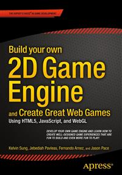

# Apress Source Code

This repository accompanies [*Build your own 2D Game Engine and Create Great Web Games*](http://www.apress.com/9781484209530) by Kelvin Sung, Jebediah Pavleas, Fernando Arnez, and Jason Pace (Apress, 2015).

Download the files as a zip using the green button, or clone the repository to your machine using Git.

## Releases

Release v1.0 corresponds to the code in the published book, without corrections or updates.

## Contributions

See the file Contributing.md for more information on how you can contribute to this repository.
